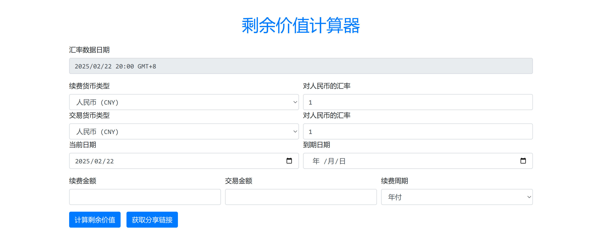

# 赞助信息

<div style="text-align: center;">
    <a href="https://www.vmiss.com/">
        
    </a>
    <a href="https://www.zovps.com/aff/VWSIBCGP">
        
    </a>
</div>


我们非常感谢[Vmiss](https://www.vmiss.com/)  [慈云数据](https://www.zovps.com/aff/VWSIBCGP)提供了支持本项目所需的网络基础设施。


# 一键安装
> 默认使用9000端口
```shell
sudo curl -s https://raw.githubusercontent.com/betteryjs/rvc/refs/heads/master/install.sh | bash

```

# 一键卸载
```shell
sudo curl -s https://raw.githubusercontent.com/betteryjs/rvc/refs/heads/master/uninstall.sh | bash

```


# 手动安装
## 安装 `docker`
```shell
curl -fsSL https://get.docker.com -o get-docker.sh
sudo sh get-docker.sh
systemctl enable docker  
systemctl start docker
rm get-docker.sh
```
## 安装`docker-compose`
```shell
sudo curl -L "https://github.com/docker/compose/releases/latest/download/docker-compose-$(uname -s)-$(uname -m)" -o /usr/local/bin/docker-compose
sudo chmod +x /usr/local/bin/docker-compose
```

## 配置
```shell
mkdir rvc
vim docker-compose.yml 
```
```shell

version: '3'
services:
    checkip:
        image: reg.naloong.de/library/rvcShare:latest
        container_name: rvc
        restart: unless-stopped
        ports:
            - '9000:80'
```
```shell
sudo docker-compose up -d
```
## 在Nginx proxy manager 面板进行反向代理

## 展示



